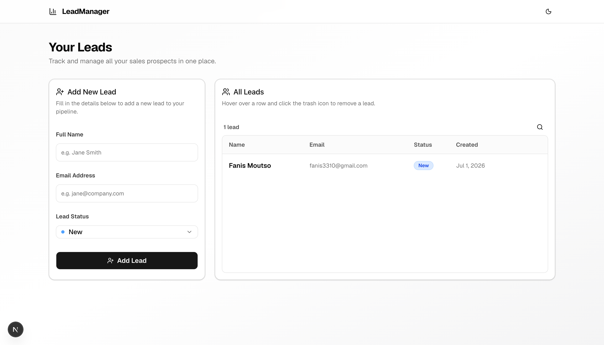
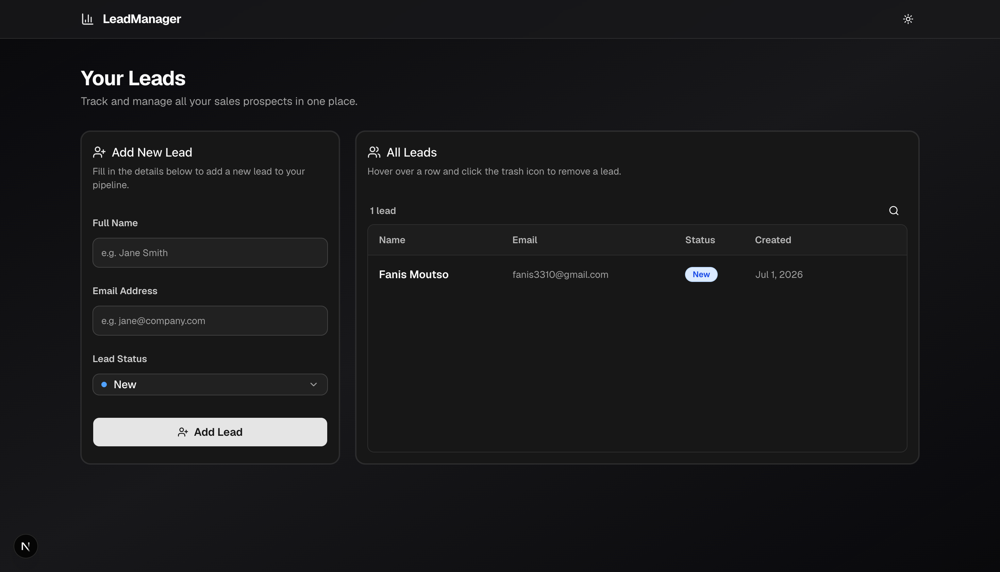

<div align="center">

# 🚀 Lead Manager

A full-stack lead management dashboard built with Next.js 16, Express, and MongoDB.

[](https://nextjs.org)
[](https://react.dev)
[](https://tailwindcss.com)
[](https://expressjs.com)
[](https://mongodb.com)
[](https://typescriptlang.org)
[](LICENSE)

</div>

---

## 📸 Screenshots

<div align="center">

| Light Mode | Dark Mode |
|:----------:|:---------:|
|  |  |

</div>

> **Tip:** Add your screenshots to a `screenshots/` folder in the repo root. Name them `light.png` and `dark.png` (or update the paths above).

---

## ✨ Features

- **Full CRUD** — Create, read, update, and delete leads
- **Live validation** — Email field validates in real-time with red/green indicators
- **Inline editing** — Edit any lead directly in the table without a modal
- **Smart search** — Animated search bar that filters by name, email, or status instantly
- **Dark mode** — System-aware dark/light toggle with smooth CSS transitions
- **Delete confirmation** — Custom modal that requires typing "yes" to confirm
- **Responsive** — Works on desktop, tablet, and mobile
- **Professional UI** — Built with shadcn/ui and Tailwind CSS

---

## 🛠 Tech Stack

| Layer | Technology |
|:------|:-----------|
| **Frontend** | Next.js 16, React 19, TypeScript, Tailwind CSS 4, shadcn/ui |
| **Backend** | Node.js, Express 5, Mongoose 9 |
| **Database** | MongoDB Atlas |
| **Icons** | Lucide React |

---

## 📦 Project Structure

```
lead-manager/
├── backend/                # REST API (Express + Mongoose)
│   ├── server.js           # API server (port 8080)
│   ├── models/
│   │   └── Lead.js         # Mongoose schema
│   ├── .env.example        # Environment template
│   └── package.json
├── frontend/               # Next.js app (port 3000)
│   └── src/
│       ├── app/
│       │   ├── page.tsx           # Main dashboard page
│       │   ├── layout.tsx         # Root layout
│       │   └── globals.css        # Global styles + theme
│       ├── components/
│       │   ├── LeadForm.tsx       # Add lead form
│       │   ├── LeadList.tsx       # Leads table
│       │   └── ui/                # shadcn/ui components
│       ├── lib/
│       │   ├── api.ts             # API service layer
│       │   └── utils.ts           # Utilities
│       └── ...
└── README.md
```

---

## 🔌 API Endpoints

| Method | URL | Description | Example |
|:-------|:----|:------------|:--------|
| `GET` | `/leads` | Fetch all leads (newest first) | `curl http://localhost:8080/leads` |
| `POST` | `/leads` | Add a new lead | `curl -X POST .../leads -d '{"name":"Jane","email":"j@e.com"}'` |
| `PUT` | `/leads/:id` | Update a lead | `curl -X PUT .../leads/<id> -d '{"status":"Engaged"}'` |
| `DELETE` | `/leads/:id` | Remove a lead | `curl -X DELETE .../leads/<id>` |

### Lead Schema

```json
{
  "name": "Jane Doe",
  "email": "jane@example.com",
  "status": "New",
  "createdAt": "2026-07-01T12:00:00.000Z"
}
```

**Status values:** `New` | `Engaged` | `Proposal Sent` | `Closed-Won` | `Closed-Lost`

---

## 🚀 Getting Started

### Prerequisites

- **Node.js** ≥ 18
- **MongoDB Atlas** account ([free tier works](https://mongodb.com/atlas))

### 1. Clone & Setup Backend

```bash
git clone https://github.com/Fanis3310/lead-manager-fullstack.git
cd lead-manager-fullstack/lead-manager/backend

# Create your .env file
cp .env.example .env
```

Edit `.env` — paste your MongoDB connection string:

```env
MONGODB_URI=mongodb+srv://<user>:<password>@<cluster>.mongodb.net/<db>?retryWrites=true&w=majority
PORT=8080
FRONTEND_URL=http://localhost:3000
```

```bash
npm install
npm run dev
```

> ✅ Backend running at **http://localhost:8080**

### 2. Setup Frontend

Open a **second terminal**:

```bash
cd lead-manager-fullstack/lead-manager/frontend
npm install
npm run dev
```

> ✅ Frontend running at **http://localhost:3000**

### 3. Open the App

Navigate to **[http://localhost:3000](http://localhost:3000)** — you're ready to manage leads!

---

## 🔧 Environment Variables

| Variable | Description | Default |
|:---------|:------------|:--------|
| `MONGODB_URI` | MongoDB Atlas connection string | *(Required)* |
| `PORT` | Backend API port | `8080` |
| `FRONTEND_URL` | CORS allowed origin | `http://localhost:3000` |

---

## 👤 Author

**Fanis3310** — [GitHub](https://github.com/Fanis3310)

---

## 📄 License

This project is licensed under the **MIT License** — see the [LICENSE](LICENSE) file for details.

---

<div align="center">

Made with ❤️ for the Lead Manager assessment

</div>
